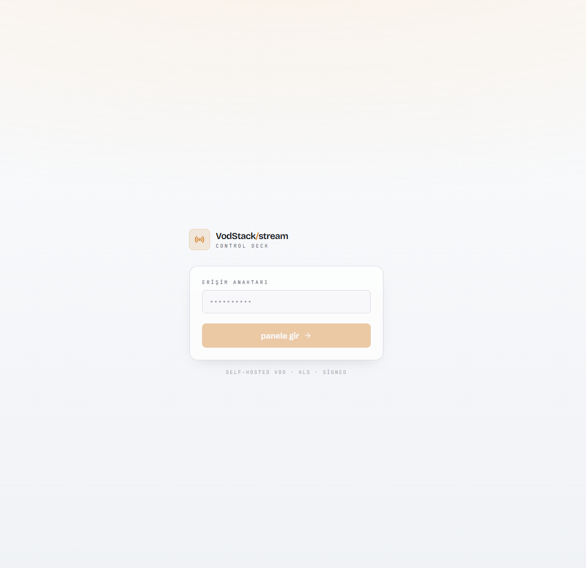
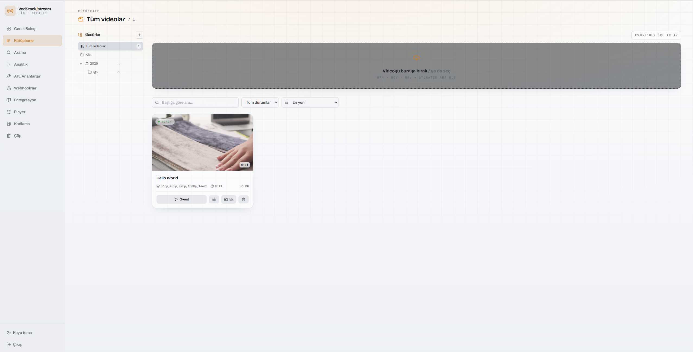
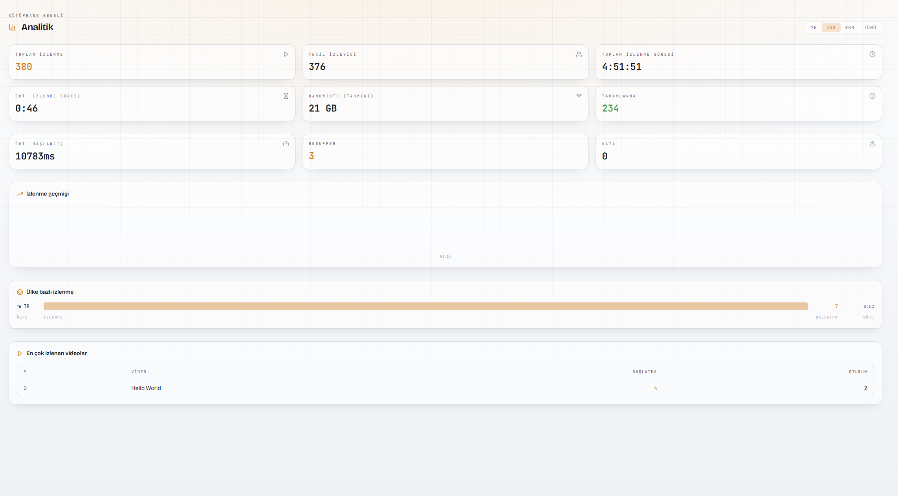

# Vodstack

**Self-hosted video streaming, end to end.** Vodstack is a lightweight,
high-traffic **VOD** platform you can run on your own infrastructure — a
self-hostable alternative to services like Bunny Stream, Mux or Vimeo.

Upload a video and Vodstack transcodes it into an adaptive-bitrate **HLS** ladder
(240p → 2160p, fMP4/CMAF), stores it in **MinIO** (S3), and serves it through an
nginx edge cache protected by **HMAC signed URLs**. It ships with a React admin
panel, a rich player, a typed TypeScript SDK, webhooks, metrics, backups and
optional AES-128 encryption, AV1, captions/ASR and in-video semantic search.

> Video status integers mirror Bunny Stream's, so a frontend that already speaks
> that API needs little to no remapping: `0 created · 1 uploaded · 2 processing ·
> 3 transcoding · 4 finished · 5 failed`.

## Screenshots

<p align="center">
  
</p>

| Video library | Analytics dashboard |
| :---: | :---: |
|  |  |

## Features

- **Adaptive HLS pipeline** — ffmpeg ABR ladder (240p/360p/480p/720p/1080p/1440p/2160p), fMP4/CMAF segments, per-library encoding tiers.
- **Signed-URL security** — HMAC tokens validated at an nginx + njs edge tier; one token covers the whole playlist prefix, with token refresh on expiry mid-playback.
- **Edge cache** — NVMe `proxy_cache` edge in front of an origin shield over MinIO, built for high concurrent traffic.
- **Admin panel** — React + Vite + Tailwind SPA: drag-drop upload, live status grid with posters, live encode progress, in-panel hls.js playback, copy play/embed URLs, folders, soft-delete trash.
- **Rich player** — Vidstack-based player with seek-preview thumbnails, YouTube-style chapters, caption/subtitle tracks (VTT/SRT), playback-speed and quality menus.
- **Import from URL** — paste any MP4/HLS source URL and the worker ingests and transcodes it server-side — the migration path from an existing catalog, no browser upload needed.
- **TypeScript SDK** — typed client in [`sdk/`](sdk/) for video CRUD, presigned uploads, signed playback and webhook signature verification.
- **Webhooks** — signed event callbacks (`X-Vodstack-Signature`) on transcode lifecycle changes.
- **AES-128 encryption** (optional) — encrypted HLS with key URIs served from the API.
- **AV1** (optional) — additional AV1 renditions alongside H.264.
- **Captions & search** (optional) — WhisperX ASR for auto-captions plus hybrid (pgvector + pg_trgm) in-video semantic search.
- **Ops** — Prometheus metrics on API + worker, a provisioned Grafana dashboard, `pg_dump` + `mc mirror` backups, signed-URL key rotation, per-video access control, 15-day recoverable trash, API keys and rate limiting.

## Architecture

```
admin --create+upload--> API (Go) --> MinIO (raw/)        Postgres (metadata)
                           | enqueue (asynq/Redis)
                           v
                        Worker (Go + ffmpeg) --ABR HLS--> MinIO (hls/{id}/)
                           |
viewer --signed .m3u8--> EDGE nginx+njs (HMAC, NVMe cache) --> ORIGIN nginx --> MinIO
```

| Component | Tech | Role |
|---|---|---|
| `cmd/api` | Go (chi) | Video CRUD, presigned upload, transcode enqueue, signed play URLs |
| `cmd/worker` | Go + ffmpeg | Probe + ABR HLS transcode, mirror output to MinIO |
| Queue | asynq (Redis) | Durable, retryable transcode jobs |
| Metadata | PostgreSQL (pgx) | Video lifecycle state machine, library API keys |
| Object store | MinIO (S3) | Raw uploads + HLS output (origin of truth) |
| Origin | nginx | Reverse-proxies MinIO (origin shield) |
| Edge | nginx + njs | HMAC token validation + NVMe cache for high traffic |
| Admin | React + Vite + Tailwind | Control panel served by the `web` container |
| Player | Vidstack + hls.js | Standalone + embeddable player |

## Quick start (dev)

```bash
docker compose -f deploy/docker-compose.yml up --build -d
```

Exposed:

- **Admin panel (web)** → http://localhost:8090 (login: `vodstack-admin`)
- API → http://localhost:8080 (`/metrics`)
- **Edge (viewer-facing, token-enforced HLS)** → http://localhost:8082
- Origin (HLS, debug/internal) → http://localhost:8081
- MinIO console → http://localhost:19001 (`minioadmin` / `minioadmin`)
- Prometheus → http://localhost:9092 · Grafana → http://localhost:3001 (`admin` / `vodstack-admin`)

A dev library is seeded: `libraryId=default`, API key `dev-library-key`.

Backup on demand: `docker compose -f deploy/docker-compose.yml run --rm backup`

Signed `/play` URLs point at the **edge** (`:8082`), which validates the HMAC
token (njs) and serves from `proxy_cache`. The origin shields MinIO.

## End-to-end usage

```bash
KEY="Bearer dev-library-key"
API=http://localhost:8080/api/library/default

# 1. Create a video
VID=$(curl -s -X POST $API/videos -H "Authorization: $KEY" \
      -H 'Content-Type: application/json' -d '{"title":"Lesson 1"}' | jq -r .videoId)

# 2. Get a presigned PUT URL and upload the source
URL=$(curl -s -X POST $API/videos/$VID/upload-url -H "Authorization: $KEY" | jq -r .url)
curl -X PUT --upload-file lesson.mp4 "$URL"

# 3. Signal completion -> enqueues transcode
curl -s -X POST $API/videos/$VID/complete -H "Authorization: $KEY"

# 4. Poll until status == 4 (finished)
curl -s $API/videos/$VID -H "Authorization: $KEY" | jq '{status, availableResolutions}'

# 5. Get a signed HLS URL and play it
curl -s $API/videos/$VID/play -H "Authorization: $KEY" | jq '{hlsUrl, posterUrl}'
```

> On dev the presigned URL host is `minio:9000` (the compose network), so run the
> PUT from a container on that network, e.g.
> `docker run --rm --network vodstack_default -v <dir>:/data curlimages/curl -X PUT --upload-file /data/lesson.mp4 "$URL"`.

## Admin panel

The React + Vite + Tailwind control panel lives in [`web/`](web/) and is served
by the `web` container at http://localhost:8090. Auth is a simple admin password
(`ADMIN_PASSWORD`, default `vodstack-admin`) backed by a signed session cookie.
The panel talks to an `/admin/*` BFF on the API; the **library API key is never
exposed to the browser** — the BFF operates on `ADMIN_LIBRARY_ID` server-side.
The web nginx proxies `/admin` to the API (same-origin cookie) and streams
uploads through (`proxy_request_buffering off`).

Dev (hot reload, needs Node): `cd web && npm install && npm run dev`
(Vite proxies `/admin` to `localhost:8080`).

## SDK

A typed TypeScript client lives in [`sdk/`](sdk/):

```ts
import { Vodstack } from "@vodstack/stream-sdk"

const vs = new Vodstack({
  baseUrl: "https://stream.example.com",
  libraryId: "default",
  apiKey: process.env.VODSTACK_API_KEY!, // never ship this to the browser
})

const video = await vs.createVideo({ title: "Lesson 1" })
const { hlsUrl, posterUrl } = await vs.getPlayUrl(video.videoId)
```

## API

| Method | Path | Purpose |
|---|---|---|
| POST | `/api/library/{lib}/videos` | Create a video record |
| POST | `/api/library/{lib}/videos/{id}/upload-url` | Presigned PUT URL for the raw source |
| POST | `/api/library/{lib}/videos/{id}/complete` | Confirm upload, enqueue transcode |
| POST | `/api/library/{lib}/videos/{id}/fetch` | Ingest from a source URL into an existing video |
| GET  | `/api/library/{lib}/videos/{id}` | Metadata + status |
| GET  | `/api/library/{lib}/videos/{id}/play` | Signed HLS + poster URL |
| DELETE | `/api/library/{lib}/videos/{id}` | Delete record + purge objects |
| GET | `/healthz`, `/readyz` | Health probes |

The full OpenAPI spec is at [`deploy/openapi.yaml`](deploy/openapi.yaml).

API keys are issued per library and accepted as `Authorization: Bearer vds_…`
(or `AccessKey: vds_…` for Bunny-style clients). Keys are stored hashed (SHA-256);
the plaintext is shown once at creation time.

## Production deployment

A production compose file, env template and full guide live in [`deploy/`](deploy/):

```bash
cp deploy/.env.prod.example deploy/.env.prod
# fill in FIXED_IP and EVERY secret (openssl rand -hex 32)
docker compose --env-file deploy/.env.prod -f deploy/docker-compose.yml up --build -d
```

`.env.prod` is git-ignored — **never commit real secrets**. See
[`deploy/DEPLOY.md`](deploy/DEPLOY.md) for hardening (fixed-IP binding, SSH-tunnel
ops services, resource isolation) and [`deploy/CDN.md`](deploy/CDN.md) for the
optional Cloudflare Tunnel setup.

## Building without Go on the host

Go isn't required on the host; everything builds in containers:

```bash
docker run --rm -v "$PWD":/src -w /src golang:1.25-bookworm sh -c "go mod tidy && go build ./..."
docker run --rm -v "$PWD":/src -w /src golang:1.25-bookworm sh -c "go test ./..."
```

## Project layout

```
cmd/          API + worker entrypoints
internal/     domain logic (httpapi, worker, transcode, db, token, webhooks, …)
web/          React admin panel
sdk/          TypeScript client SDK
deploy/       docker-compose, nginx, grafana/prometheus, backup, env templates
loadtest/     k6 playback load test
```

## Contributing

Issues and pull requests are welcome. Please run `go test ./...` (and
`npm run build` in `web/`) before opening a PR.

## License

Released under the [MIT License](LICENSE).

## Trademarks

Bunny, Bunny Stream, Mux and Vimeo are trademarks of their respective owners.
Vodstack is an independent, community-driven project and is **not** affiliated
with, endorsed by, or sponsored by any of them. These names are used only for
identification and accurate comparison, to describe what Vodstack does.
